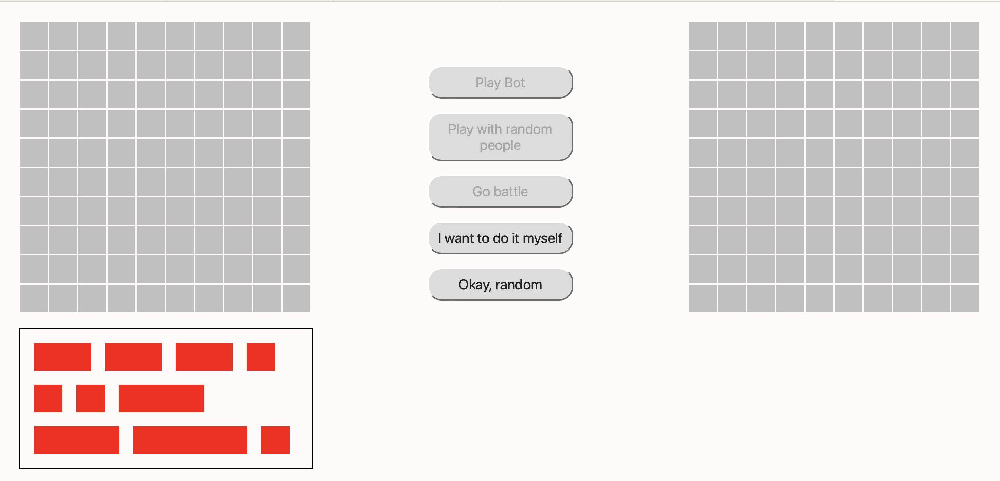
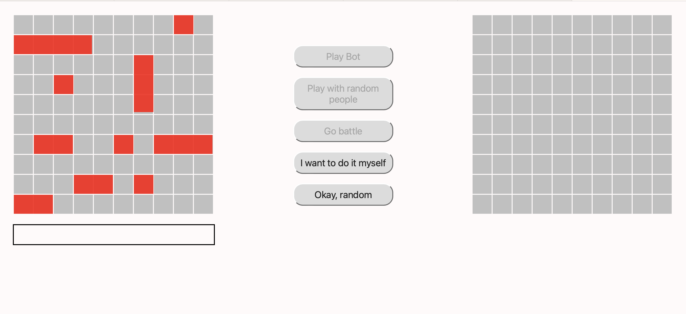

# KURSACH

## Middle version of app

### На данный момент мы уже сделали примерный внешний вид нашей программы (потом будет модифицироваться).

### Это примерный вид нашей программы с кораблями в доке и с кораблями на поле.

### Примеры кода вы можете посмотреть в branch - Yarik 
### ( https://github.com/ProstoVad/KURSACH/tree/Yarik )

### Проблемы с которыми мы столкнулись при работе:

*  установка корабля на уже имеющийся на поле корабль
*  несовместимость между размером корабля и ячейкой таблицы
*  поворот корабля на границе поля
*  незапланированный переход с ООП на ФП

### Решения данных проблем:

Первый пункт на данном этапе не решён.  Пройдемся по остальным:

Несовместимость между размерами корабля и ячейки заключалось в том, что узел td хранит только один тег. Поскольку корабль состоит из нескольких td, была необходимость продумать установку корабля на заданное число ячеек 
Проблема была решена перекрытием ячеек. Корабль хранится в одном td, но за счёт z-index своей формой распространяется на остальные.

Поворот корабля на границе.

Проблема заключалась в невозможности установить корабль на другие ячейки с краю после поворота на границе. Решилась возвращением исходного массива size для дальнейшего перетаскивания корабля

Переход с ООП на ФП был обусловлен недоступностью обращаться к элементам класса в обработчике событий. Каждый корабль хранит DOM-объект. Поскольку обработчик события вызывается исключительно для него, в теле функции нельзя никах получить доступ к полям класса
Поэтому было решено перейти из классов в набор функций, в целом для работы с object
